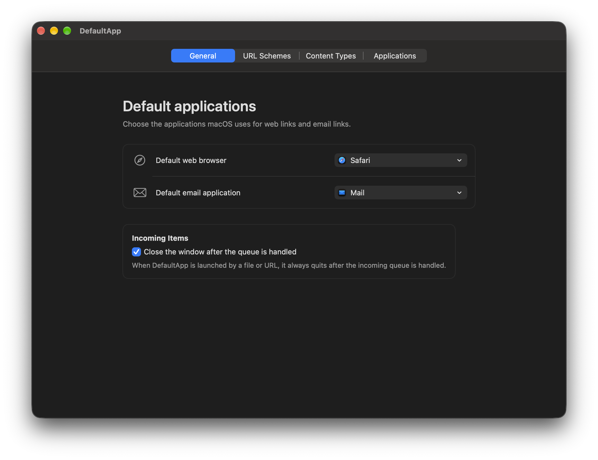
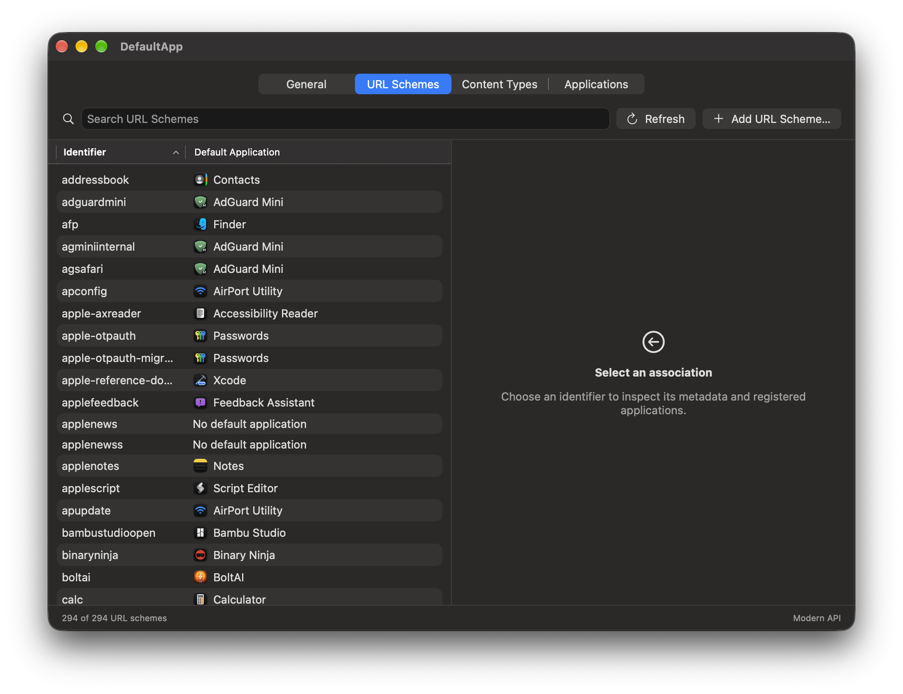
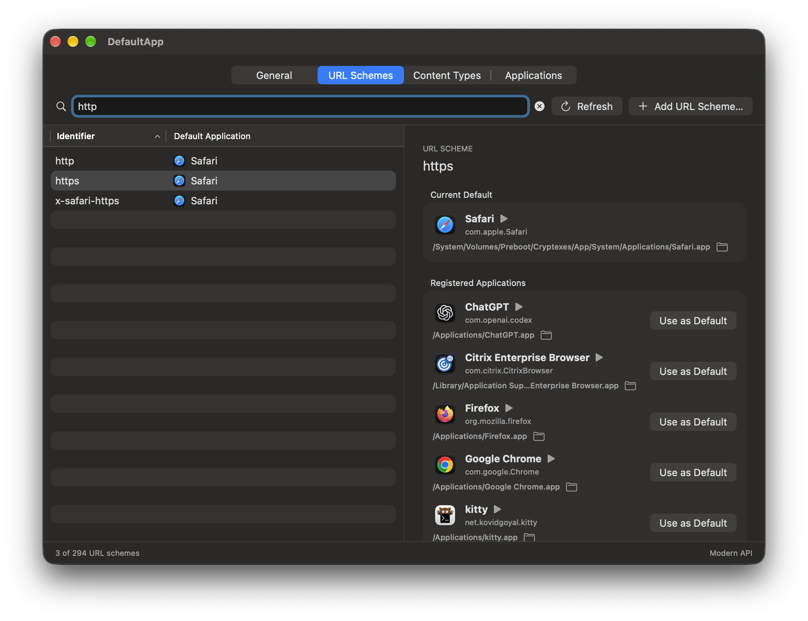
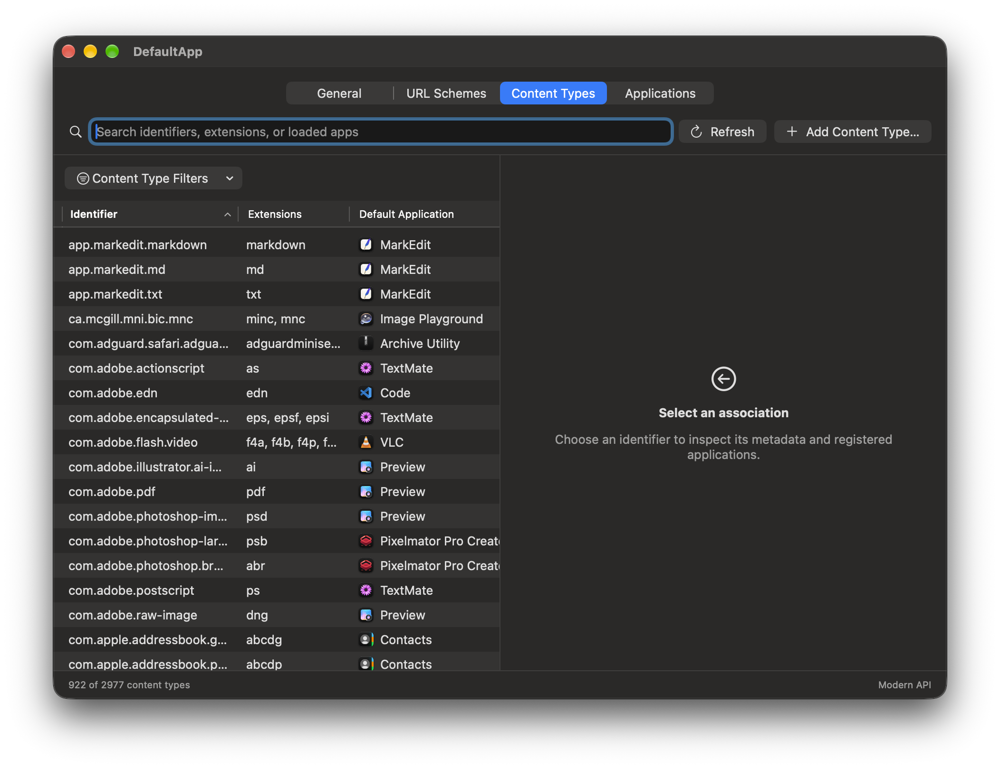
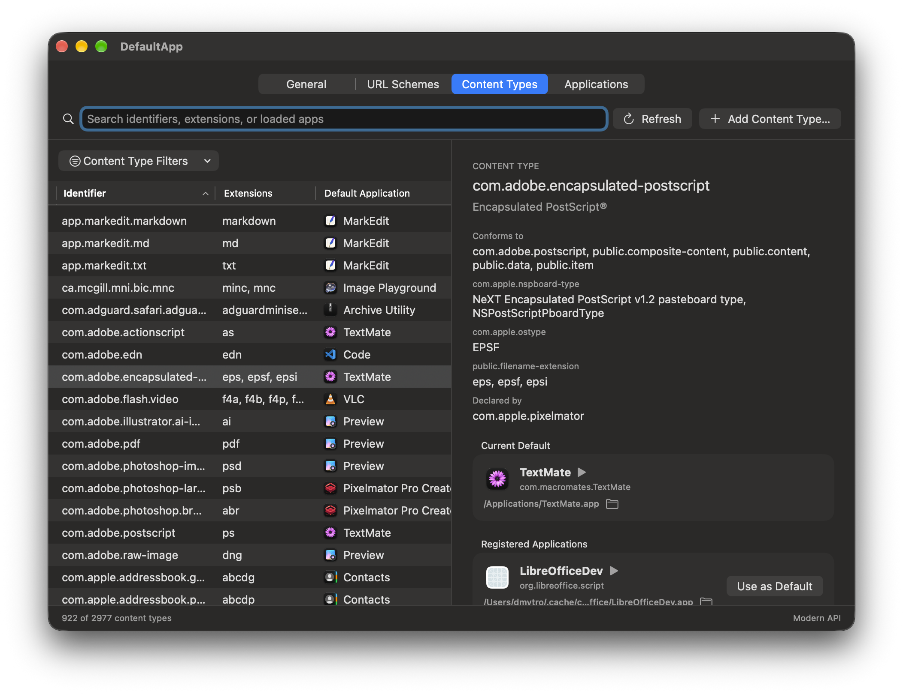
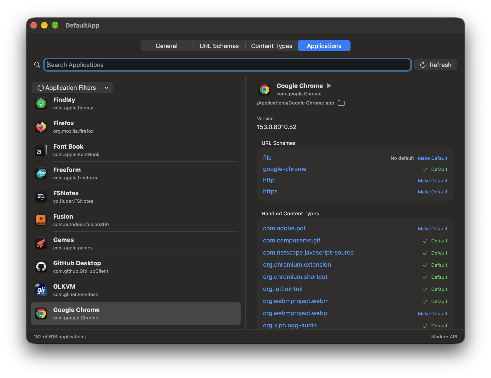
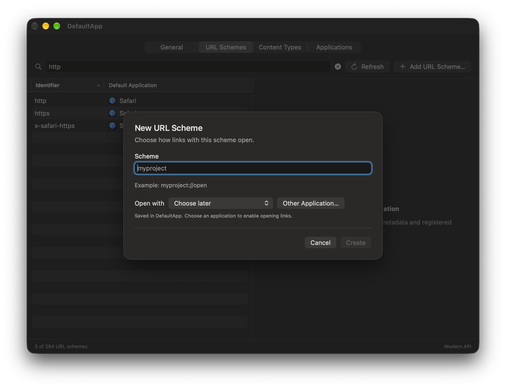
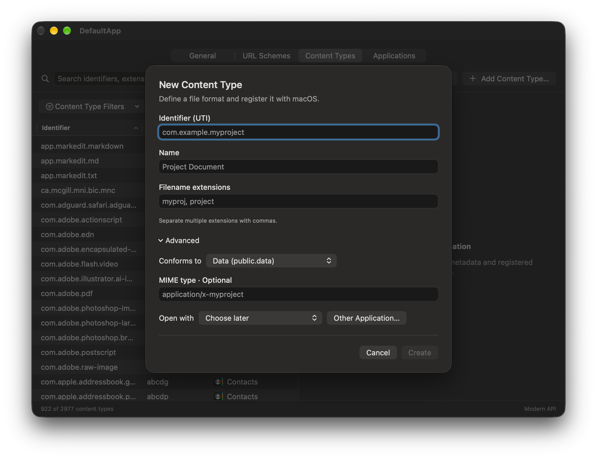
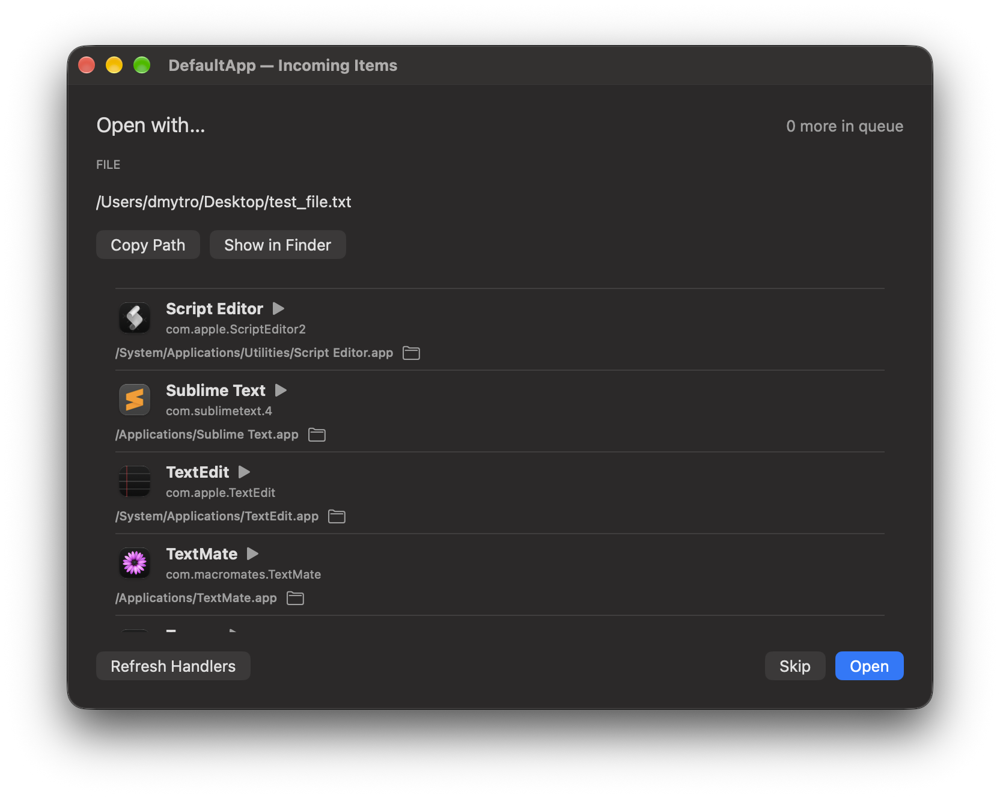

<p align="center">
  
</p>

<h1 align="center">DefaultApp</h1>

<p align="center">
  A macOS app for convenient analysis, verification, and management of system handlers.
</p>

<p align="center">
  macOS 12+ · GUI · CLI · MIT
</p>



DefaultApp makes macOS file, URL, and application associations easier to
understand. It shows the current default handler, every application registered
for an association, and the declarations behind each result. DefaultApp supports
both the modern and legacy LaunchServices APIs, so you can compare their results
and verify system behavior from one place.

## Using the app

### Choose everyday defaults

Open **General** to review or change the default web browser and email app.

### Inspect URL handlers

Open **URL Schemes** to search registered schemes such as `https`, `mailto`, or
custom deep links. Select a scheme to see its current default and all known
handlers, then choose **Use as Default** to change it.

<table>
  <tr>
    <td width="50%"></td>
    <td width="50%"></td>
  </tr>
</table>

### Inspect file associations

Open **Content Types** to find a type by identifier or filename extension. The
details view shows its metadata, conformance hierarchy, current default, and
registered applications.

<table>
  <tr>
    <td width="50%"></td>
    <td width="50%"></td>
  </tr>
</table>

### Review an application

Open **Applications** and select an installed app to see the URL schemes and
content types it handles. You can change individual defaults from the same view.



### Add an association

Use the add button in **URL Schemes** or **Content Types** to register a custom
association and optionally assign its handler immediately.

For an undeclared file extension, choose **Use a dynamic type** in the content
type form. Enter one extension and choose an application. macOS derives a
`dyn.*` identifier from the extension; DefaultApp saves the default handler for
that identifier through Launch Services. It does not install a type declaration
or teach the selected app to read the file format. A handler selection is
required because resolving the dynamic identifier alone does not register a
handler preference.

The **Only dynamic types** filter shows dynamic types found in Launch Services
handler preferences. DefaultApp reads these from `lsregister -dump` because the
available public APIs query handlers for a known content type but do not list
all handler preferences. The dump is diagnostic output rather than a stable
API; a format change may hide entries, while a command failure appears in
Diagnostics.

<table>
  <tr>
    <td width="50%"></td>
    <td width="50%"></td>
  </tr>
</table>

### Route incoming files and URLs

When DefaultApp is selected as a handler, **Incoming Items** lets you choose the
destination app, reveal a file in Finder, copy its path, or skip it.



### Compare handler APIs

Use **Diagnostics** to inspect the available system data and compare the Modern
and Legacy backends when a handler result looks incomplete or unexpected.

Use **⌘F** to search, **⌘R** to refresh, and **⌘1–⌘5** to move between sections.

> [!CAUTION]
> Handler changes take effect system-wide and have no built-in undo. To restore a
> setting, select the previous handler again.

## Using the CLI

The `defaultapp` command is included in the application bundle. If DefaultApp is
installed in `/Applications`, run it with:

```sh
/Applications/DefaultApp.app/Contents/Resources/bin/defaultapp --help
```

For a shorter command during the current Terminal session:

```sh
alias defaultapp='/Applications/DefaultApp.app/Contents/Resources/bin/defaultapp'
```

Common examples:

```sh
# List installed applications or output structured JSON.
defaultapp apps
defaultapp apps --json

# List known URL schemes and content types.
defaultapp schemes
defaultapp types

# Inspect all handlers or the current default.
defaultapp handlers scheme https
defaultapp get uti public.png

# Compare the modern and legacy APIs.
defaultapp handlers scheme https --backend modern
defaultapp handlers scheme https --backend legacy

# Change a default handler.
defaultapp set scheme mailto --app com.apple.mail

# Run diagnostics.
defaultapp doctor
```

Use `--json` with read-only commands for machine-readable output. Handler
commands accept `--backend modern|legacy`; the Modern backend is used by default.
For content types, the Legacy backend also supports
`--role all|viewer|editor|shell`.

Run `defaultapp --help` to see the complete command syntax.

## License

DefaultApp is available under the [MIT License](LICENSE).
